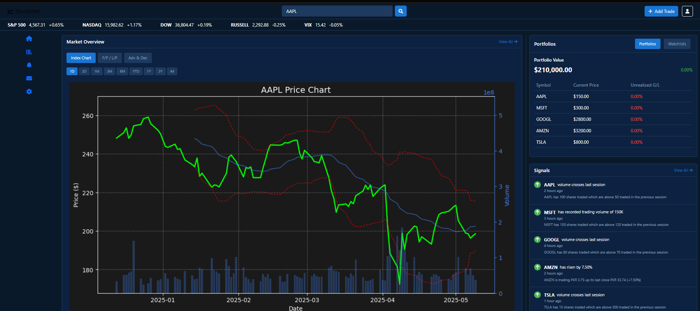

# 🚀 StockIntel - Your AI-Powered Stock Market Intelligence Platform

<div align="center">
  
  
  
</div>

> **StockIntel** is your all-in-one AI trading assistant, combining real-time market data, advanced analytics, and machine learning to empower smarter investment decisions. Whether you're a seasoned trader or just starting out, StockIntel delivers actionable insights and a seamless user experience.

---

## 🌟 Features

- Real-time market data visualization
- Technical analysis with indicators (RSI, MACD, Bollinger Bands)
- Portfolio tracking and performance analysis
- Market signals and alerts
- News and announcements integration


## Screenshots

### Home Page


### Additional Features


## Installation

```bash
# Clone the repository
git clone https://github.com/hreger/stockintel.git
cd stockintel

# Install dependencies
pip install -r requirements.txt

# Set up environment variables
# Create a .env file with your API keys and database configuration

# Run the application
python flask_app.py
```

## Technologies Used
- Flask - Web framework
- Matplotlib/Seaborn - Data visualization
- Pandas - Data manipulation
- Alpha Vantage API - Market data
- PostgreSQL - Database
- Docker - Containerization
- Kafka - Data streaming (optional)
- FastAPI - Prediction service
- Dash - Web application
- Scikit-learn - Machine learning
- Requests - HTTP requests
- BeautifulSoup - Web scraping


📁 Project Structure
```bash
stockintel/
├── data_ingestion/          # Data collection and processing
│   ├── kafka_producer.py    # Kafka producer for stock data (optional)
│   ├── kafka_consumer.py    # Kafka consumer for data processing (optional)
│   ├── init_db.py           # Database initialization
│   └── check_data.py        # Data verification
├── prediction_service/      # Machine learning predictions
│   ├── prediction_service.py # FastAPI service
│   ├── models/              # ML models
│   └── utils/               # Helper functions
├── dashboard/               # Web interface
│   ├── app.py               # Dash application
│   ├── components/          # UI components
│   └── layouts/             # Page layouts
├── portfolio/               # Portfolio management
│   └── portfolio_analyzer.py # Portfolio analysis
├── backtesting/             # Strategy testing
│   └── strategy_tester.py   # Backtesting engine
├── scanner/                 # Market scanning
│   └── market_scanner.py    # Opportunity scanner
├── requirements.txt         # Project dependencies
└── .env                     # Environment variables
```
## 🤝 Contributing

We love contributions! Here's how you can help:

1. Fork the repository
2. Create your feature branch (`git checkout -b feature/AmazingFeature`)
3. Commit your changes (`git commit -m 'Add some AmazingFeature'`)
4. Push to the branch (`git push origin feature/AmazingFeature`)
5. Open a Pull Request

## 📜 License

This project is licensed under the MIT License - see the [LICENSE](LICENSE) file for details.

## 💬 Support

Got questions? We're here to help!
- 🐛 Open an issue in the GitHub repository
- 💭 Join our [Discord community](https://discord.gg/your-discord-link)
- 📧 Email us at support@stockintel.com

## 🙏 Acknowledgments

A big thank you to:
- [Alpha Vantage](https://www.alphavantage.co/) for providing market data
- [PostgreSQL](https://www.postgresql.org/) for reliable data storage
- The amazing open-source community for their contributions

---

<div align="center">
  <p>Made with ❤️ by the StockIntel Team</p>
  <p>© 2024 StockIntel. All rights reserved.</p>
</div>
